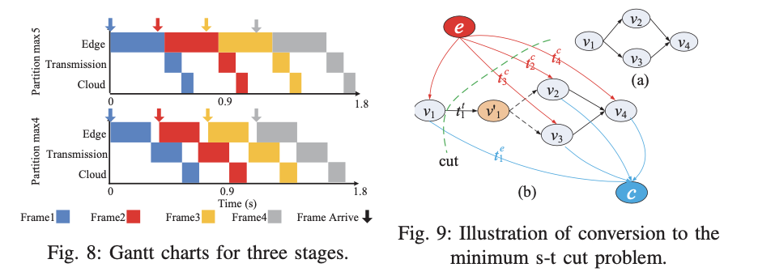
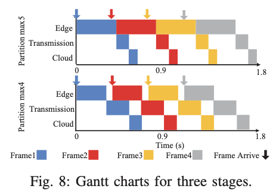
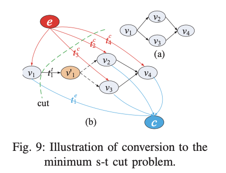
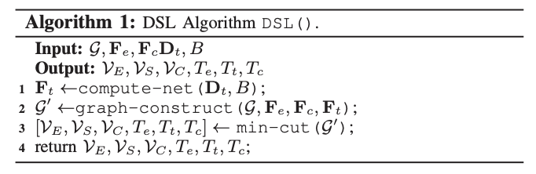
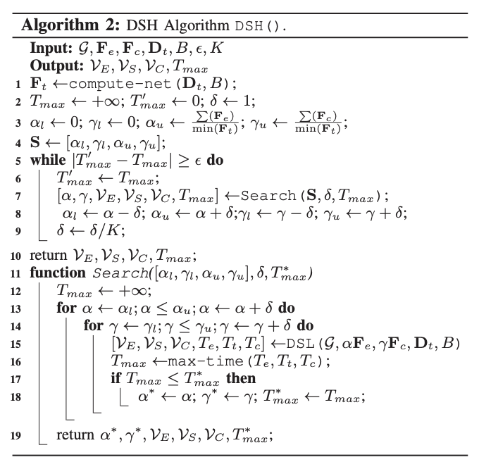
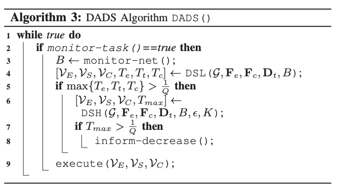

# DADS
 💻 欢迎在云边协同领域工作的同学一起交流

 💻 如果有一些代码中的bug，请提出issue，我补充解决

🥳 本项目根据经典论文进行复现：Dynamic adaptive DNN surgery for inference acceleration on the edge

论文链接🔗：[DADS](https://github.com/Tjyy-1223/DADS/blob/main/paper/DADS.pdf)

## 研究内容

**DNN的最新进展表明DNN不再局限于链式拓扑，DAG拓扑变得流行。**

例如，GoogleNet和ResNet是DAG结构。显然，将DAG图划分代替链式划分涉及更复杂的图论问题。设计了一种动态自适应DNN手术(DADS)方案，通过持续监测DNN网络状态来优化分割DNN网络。

DADS的关键设计如下：

- DADS持续监测网络状况，并确定系统是在轻载状态还是重负载状态下运行。
- **轻载条件下，** 设计DSL算法，以最小化处理一帧的总延迟。在这一部分中，为了求解时延最小化问题，我们将原问题转化为一个等价的最小割问题，以便找到全局最优解。
- **高负载情况下，** 提出了DSH算法，最大化吞吐量，即单位时间内可以处理的帧数。然而，本文证明了这类优化问题是np -难问题，不能在多项式时间复杂度内求解。DSH采用近似方法，其近似比为3。



**项目内容：**

+ 实现了将DAG拓扑DNN转化为有向图的过程
+ 实现了以dinic算法完成有向图最小割的寻找任务，并将其转化为DNN模型的划分策略
+ 将划分后的DNN模型以云边协同的模式进行推理

**局限性：**

+ 目前只实现了DSL()算法，即普通推理单个DNN任务；后续有时间的话会实现DSH()算法，解决高负载情况下的划分策略选取。
+ DADS算法需要对模型结构进行设计，包括一个DAG网络有哪些分支点、合并点，以及如何对一个DAG结构进行循环都需要自行设计。可以在models文件夹下查看模型的详细设计步骤。
+ DADS框架中，提前测量的模式测量模型在云边端设备上的推理时间，从云端设备上的推理时延需要传回本地，这增加了构建过程中的开销，且在网络条件较差时会受影响。
+ 由于在DADS的考虑中，每个节点代表了DNN的一个单层结构，这也表明了DADS很难直接应用在GoogleNet等现有复杂结构中，除非你对GoogleNet中所有层进行展开后，重构其复杂的内部结构。而对于Pytorch以及后续DNN，会将相似的结构封装在Inception Block中，而DADS只能在Inception Block两端进行划分。

## 项目结构

```python
DADS
├── server_func.py # 云边端交流的功能函数
├── cloud_api.py # 模拟云端设备入口
├── edge_api.py # 模拟边端设备入口
├── dads_framework # dads框架
│   ├── dads.py # DSL() 选取最优划分点
│   ├── dinic.py # dinic算法实现
│   └── graph_construct.py # 构建有向图算法
├── models # 采用的DNN模型
│   ├── AlexNet.py
│   ├── EasyModel.py
│   ├── InceptionBlock.py
│   ├── InceptionBlockV2.py
│   ├── VggNet.py
├── net # 网络模块
│   ├── monitor_client.py # 带宽监视器客户端
│   ├── monitor_server.py # 带宽监视器服务端
│   └── net_utils.py # 网络功能方法
├── paper # 论文
│   └── DADS.pdf
└── utils # 其他工具
    ├── excel_utils.py # excel操作
    └── inference_utils.py # 协同推理功能函数
```


## 运行环境

```
python 3.9
torch==1.9.0.post2
torchvision==0.10.0
xlrd==2.0.1
apscheduler
```

## 项目运行

### 单任务模式

+ **一般用于评估对于DNN推理时延的性能改进：每次需要通过指令向客户端提供任务**
+ **带宽数据为每次进行推理之前 进行单次监测**

云端设备上运行 ： 可以改成服务端开放的ip和端口；-d表示云端使用cpu还是gpu：输入参数"cpu"或"cuda"

```python
 python cloud_api.py -i 127.0.0.1 -p 9999 -d cpu
```

边端设备上上运行：-i和-d为服务端开放的ip和端口；-d表示边端使用cpu还是gpu：输入参数"cpu"或"cuda"

```python
 # -t表示模型类型 传入参数可以为 "alex_net" "vgg_net" "easy_net" "inception" "inception_v2"
python edge_api.py -i 127.0.0.1 -p 9999 -d cpu -t easy_net
```

**单机运行结果如下：**

**云端设备：** python cloud_api.py -i 127.0.0.1 -p 9999 -d cpu

```
monitor server get bandwidth : 3192.4125617104364 MB/s 
successfully connection :<socket.socket fd=6, family=AddressFamily.AF_INET, type=SocketKind.SOCK_STREAM, proto=0, laddr=('127.0.0.1', 9999), raddr=('127.0.0.1', 55700)>
get model type successfully.
short message , model latency on the cloud device. has been sent successfully
get partition point successfully.
get edge_output and transfer latency successfully.
short message , transfer latency has been sent successfully
easy_net 在云端设备上推理完成 - 0.001 ms
short message , cloud latency has been sent successfully
================= DNN Collaborative Inference Finished. ===================
```

**边端设备：** python edge_api.py -i 127.0.0.1 -p 9999 -d cpu -t easy_net

```
(tjyy) tianjiangyu@tianjiangyudeMacBook-Pro Neurosurgeon % python edge_api.py -i 127.0.0.1 -p 9999 -d cpu -t alex_net
get bandwidth value : 3192.4125617104364 MB/s
short message , model type has been sent successfully
start construct graph for model...
partition edges : []
short message , partition strategy has been sent successfully
easy_net 在边缘端设备上推理完成 - 2.193 ms
get yes , edge output has been sent successfully
easy_net 传输完成 - 0.232 ms
easy_net 在云端设备上推理完成 - 0.001 ms
================= DNN Collaborative Inference Finished. ===================
```


## 论文细节

#### A. The Impact of DNN Inference Workloads



**（1）在轻工作负载下是这样的:对于每个阶段，当前帧在下一帧到达之前完成。如图8下面的子图展示** ，数学上表示为：


$$
max\{t_c,t_t,t_e \} \lt 1/Q
$$


甘特图表示如图8，这种情况下，我们只需要尽快完成每一帧，即最小化 


$$
T_e + T_c + T_t
$$


**（2）当系统负载较大时，最小化Te+Tt+ Tc可能会导致系统拥塞**


$$
max\{t_c,t_t,t_e \} \ge 1/Q
$$


例如，在图8中靠上的子图，由于边缘设备上推理时延过长，使下一帧在当前帧完成边缘之前到达。因此，在这种情况下，**我们需要最大化系统的吞吐量**，即最小化 


$$
max\{t_c,t_t,t_e \}
$$


即最大化系统吞吐量：在单位时间内可以处理的任务数量。


#### B. The Light Workload Partitioning Algorithm



**构建了一个新的图G'，使每个边只捕获一个延迟值,将ECDI-L问题转化为G的最小加权s-t切割问题。**

首先介绍了如何在G的基础上构造G。

- Cloud Computing Delay：red links，用来捕获云计算时延
- Edge Computing Delay：blue links，以捕获v的边缘计算延迟。
- Communication Delay：其他所有links对应通信时延，为解决如图中v1有多个后继节点，所以引入了v1'。

红、蓝、黑对应成本是云计算、边缘计算和通信延迟。虚线链接被赋予无穷大。

**ECDI-L等价于G的最小e-c cut。**

- 如果对e到vi的链接进行切割(图9(b)所示的红色链接)，则vi将在云端进行处理
- 如果从vj到c进行链接切割(图9(b)中的蓝色链接)，则将vj加工在边缘上
- 如果对vi到vj进行链路切割(图9(b)所示黑色链路)，则将vi的数据传输到云端

红色链路的总切割成本等于云计算时间Tc。蓝色边的总切割成本等于边的计算时间Te。黑色链路的总剪切代价等于不考虑网络延迟Tt的传输时间。如果G的e-c cut最小，则单个帧上的推理延迟最小。




#### C. The Heavy Workload Partitioning Algorithms




#### D. The Dynamic Partitioning Algorithm



网络状态是变化的，将动态地影响工作负载模式的选择和分区决策；设计了DADS以适应网络的动态变化。如算法3所示：

- monitor-task()监控视频是否活动(第2行)。这可以通过“iperf”工具实现。具体实现参见第四节。
- 实时网络带宽由monitor-net()(第3行)推导得到
- 调用DSL()计算分区策略(第4行)。
- 此时，如果处于轻负载模式，并且通过DSL进行分区是被接受的；否则，系统处于重负载模式，调用DSH()调整分区策略以最小化最大延迟(第6行)。然而，如果完成率仍然小于采样率，则说明采样率过大，即使DSH()也不能满足采样率。系统将会拥塞。它调用用户降低采样率(第7-8行)。

## 交流

如果对本项目有更好的想法或者交流，可以在GitHub Issue提出问题
